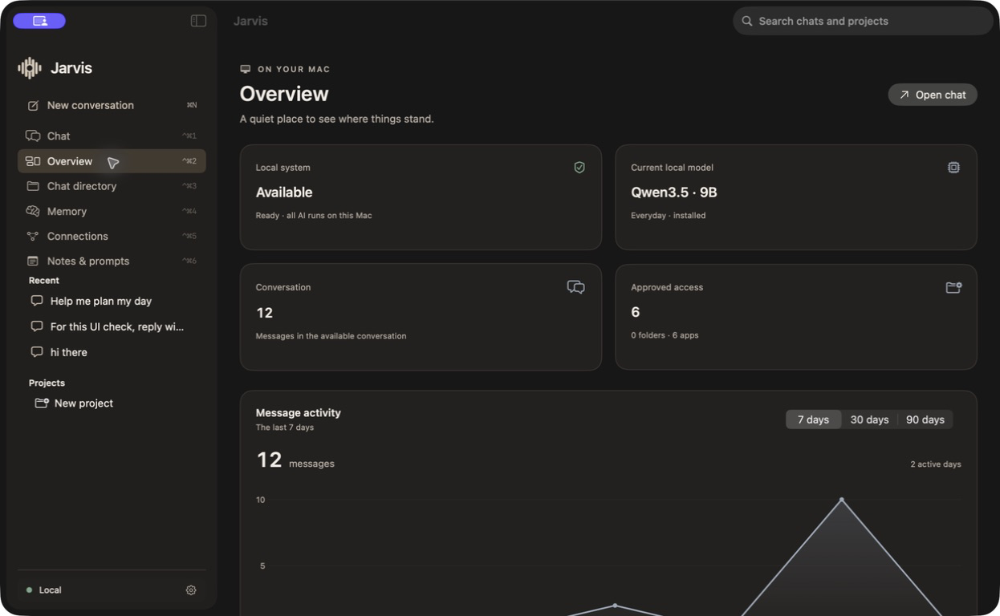
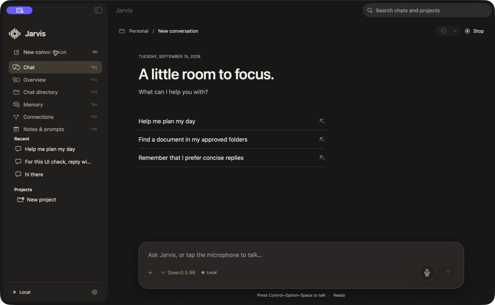
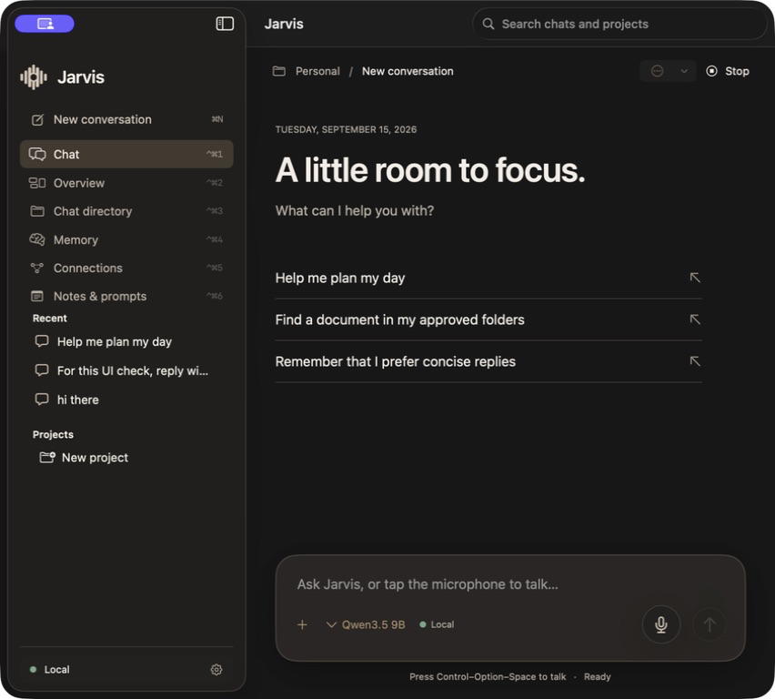
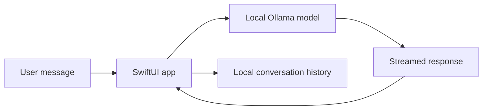
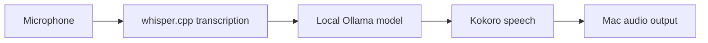
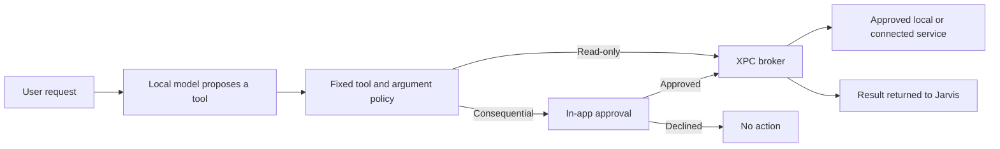
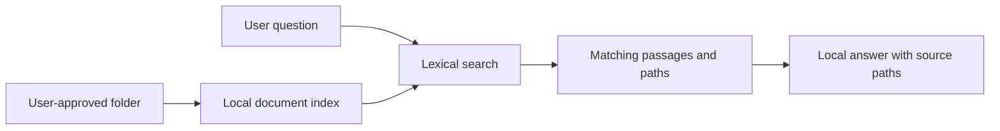

<div align="center">
  
  <h1>Jarvis</h1>
  <p><strong>A native, local-first AI assistant for macOS.</strong></p>
  <p>Private conversations, voice, memory, document search, and permission-gated actions—built in SwiftUI and designed to keep AI inference on your Mac.</p>
</div>

> [!IMPORTANT]
> **Jarvis is a work in progress.** This repository documents an active prototype, not a finished or distributable product. Setup is still developer-oriented, some integrations require your own credentials, and several workflows need more real-world validation.




## What Jarvis does

Jarvis is a single-user macOS assistant that combines a native SwiftUI interface with local language, speech-to-text, and text-to-speech models. It is being built as a calm workspace for everyday assistance—not as a web dashboard or a cloud chatbot wrapper.

- Runs conversations through local Ollama models on a loopback-only server.
- Supports typed chat and a spoken conversation flow with local transcription and speech.
- Organizes conversations, projects, notes, and reusable prompts.
- Saves explicit memories only after the user asks and approves the action.
- Searches PDF, Markdown, and text files inside user-approved folders.
- Can open approved apps and propose file, email, calendar, and reminder actions.
- Connects to Gmail and Google Calendar with user-provided OAuth credentials.
- Supports optional Brave Search with a user-provided API key.
- Shows local activity, model availability, conversation counts, and approved access.
- Keeps consequential actions behind a visible approval step.

## Visual language

The original concept artwork below sets the atmosphere for Jarvis: quiet presence, deliberate focus, and a protected local workspace. It is design artwork for the project, not a representation of product screens.

<table>
  <tr>
    <td width="50%" valign="top">
      
      <br><strong>Voice presence</strong><br>
      A composed, human-feeling voice experience without turning the workspace into a spectacle.
    </td>
    <td width="50%" valign="top">
      
      <br><strong>Private by design</strong><br>
      Personal context stays contained in a local-first environment with deliberate boundaries.
    </td>
  </tr>
  <tr>
    <td colspan="2" valign="top">
      
      <br><strong>Focused workspace</strong><br>
      A calm companion for complex work, built to keep attention on the task rather than the interface.
    </td>
  </tr>
</table>

## Screenshots

### Chat workspace



### Adaptive narrow layout



The screenshots are captures of the native macOS app. The conversations shown are local test content; no mock browser UI is used by the application.

## Core workflows

### Text conversation



### Spoken conversation



Voice is session-based: the user starts a spoken conversation, Jarvis detects the end of an utterance, transcribes it locally, generates a response locally, and speaks the reply. The current speech pipeline is focused on English, with experimental Telugu and mixed-language handling.

### Tool and action approval



Read-only actions can inspect approved resources. Consequential operations—such as sending email, changing a calendar event, saving memory, moving a file, or placing a file in Trash—must pass strict argument validation and receive explicit approval.

### Local document search



Jarvis only indexes folders chosen through the macOS file picker. Supported retrieval currently covers PDF, Markdown, and plain-text content. Vector embeddings and knowledge collections are planned, not implemented.

## Privacy and security model

- **Local inference:** everyday and deep model requests go to Jarvis's loopback-only Ollama process; cloud model APIs are not part of the runtime.
- **Encrypted storage:** credentials, memories, workspace records, and settings are stored in an AES-GCM encrypted vault.
- **Keychain-backed unlock:** the vault root key is held by macOS Keychain and accessed from the authenticated app process.
- **Broker isolation:** tools run through a separate XPC broker whose connection is pinned to the app's code identity.
- **Least access:** file tools are restricted to selected folders, and app launching is restricted to explicitly approved bundle identifiers.
- **Explicit approvals:** potentially consequential actions are proposed in the UI before execution.
- **Untrusted content handling:** webpages, documents, and email content are treated as data rather than instructions.
- **No telemetry by design:** aggregate activity is calculated from data already in Jarvis and does not leave the Mac.

Google and Brave are optional external services. Search queries go to Brave only when web search is enabled; Gmail and Calendar requests go to Google only after connection. AI inference still remains local.

## Model modes

| Mode | Model | Intended use | Current constraint |
| --- | --- | --- | --- |
| Everyday | `qwen3.5:9b` | Normal conversation and tool use | Default local mode |
| Deep | `qwen3.8:27b` | Harder document questions and planning | Must be installed and the Mac must be on external power |

The model names are currently configured in code rather than selected from a general model catalog.

## Architecture

```text
Jarvis.app
├── JarvisApp       SwiftUI windows, navigation, chat, voice, and approvals
├── JarvisCore      model client, policies, vault, retrieval, and connectors
├── JarvisBroker    isolated XPC tool execution service
├── speech          local speech worker
├── scripts         build, benchmark, and validation utilities
├── Tests           policy, security, document, memory, and workspace tests
└── docs            design notes, architecture decisions, and screenshots
```

The broker exposes a fixed catalog rather than arbitrary shell or plugin execution. Tool names and exact argument fields are validated before any request can run.

## Current tool surface

| Area | Available operations |
| --- | --- |
| Documents | Search and read approved files |
| Apps | Open explicitly approved applications |
| Memory | Save an explicitly requested lasting preference |
| Email | Search/read Gmail, save a local draft, propose sending email |
| Calendar | List events, propose creating or updating events |
| Reminders | Propose an Apple Reminder |
| Files | Propose moving a file or placing it in Trash within approved roots |
| Web | Search through a configured Brave Search API key |

## Requirements

- macOS 26 or later
- Xcode 26 / Swift 6.2 or later
- Ollama with the desired local model weights
- Local speech runtimes and model assets for whisper.cpp and Kokoro
- Optional: Google Desktop OAuth client JSON for Gmail/Calendar
- Optional: Brave Search API key for web search

Large local runtimes, downloaded model weights, build products, credentials, and encrypted user data are intentionally excluded from Git.

## Developer build

Run the test suite:

```bash
swift test
```

Build and package `Jarvis.app`:

```bash
./scripts/build.sh
```

For the stable local signing identity used during development:

```bash
JARVIS_SIGNING_IDENTITY="Jarvis Local Signing" ./scripts/build.sh
```

The signing identity is local to the developer's Keychain and is not included in this repository. See [`docs/adr-001-code-signing-identity.md`](docs/adr-001-code-signing-identity.md) for the current signing decision.

## Validation and benchmarks

The repository includes repeatable test and benchmark scripts for tool behavior, model memory use, speech recognition, and voice latency. Historical results live under [`reports/`](reports/).

```bash
python3 scripts/tool_benchmark.py
python3 scripts/memory_probe.py
python3 scripts/speech_accuracy.py
python3 scripts/voice_benchmark.py
```

Recorded Stage 1 evidence includes a 60/60 tool-call reliability run, warm speech timings, and zero consequential actions across the ambiguous-request safety cases. These figures were gathered during prototype development and should be regenerated on the current OS and hardware before being treated as release claims. See [`STATUS.md`](STATUS.md) for the full methodology and caveats.

## Work in progress

Major remaining work includes:

- A polished first-run installer and automatic dependency/model provisioning
- Developer ID signing, notarization, and a relocatable distribution build
- More real-voice testing for Telugu and mixed-language transcription
- End-to-end validation of Google, Gmail, Calendar, and Brave integrations
- Longer thermal, memory-pressure, and sustained conversation testing
- General model download/selection management
- Richer retrieval with embeddings, reranking, and knowledge collections
- Scheduled prompts, workflow queues, richer Markdown, and optional image tooling
- App string localization and broader accessibility verification

The current roadmap and Open WebUI-inspired feature coverage are documented in [`docs/open-webui-feature-coverage.md`](docs/open-webui-feature-coverage.md). That document describes inspiration and feature comparison only; Jarvis is an independent native Swift implementation.

## Project status

Jarvis is being developed as a personal local assistant and is **not production ready**. APIs, storage formats, model choices, permissions, and installation steps may change. There is no packaged public release or support guarantee yet.

## License

No open-source license has been selected yet. Until one is added, all rights are reserved by the repository owner.
